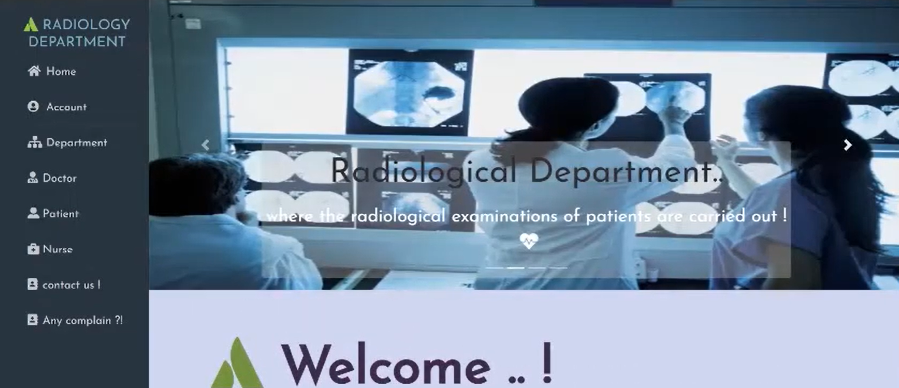

# Hospital Web App

## Overview
The Hospital Web App is a web-based application designed to manage hospital operations such as patient records, appointments, and staff management. It is built using Django, a high-level Python web framework.

## Features
- Patient Management: Add, update, and delete patient records.
- Appointment Scheduling: Schedule, update, and cancel appointments.
- Staff Management: Manage hospital staff details.

## Technologies Used
- **Django**: Backend framework.
- **HTML**: Structure of the web pages.
- **CSS**: Styling of the web pages.
- **SQLite**: Database.

## Demo
You can see the demo: "Demo.mp4"



<video width="320" height="240" controls>
  <source src="demo.mp4" type="video/mp4">
  Your browser does not support the video tag.
</video>

## Installation
To run this project locally, follow these steps:

1. **Clone the repository**
   ```bash
   git clone https://github.com/Muhammed-Elmasry/Hospital-Web-App.git
